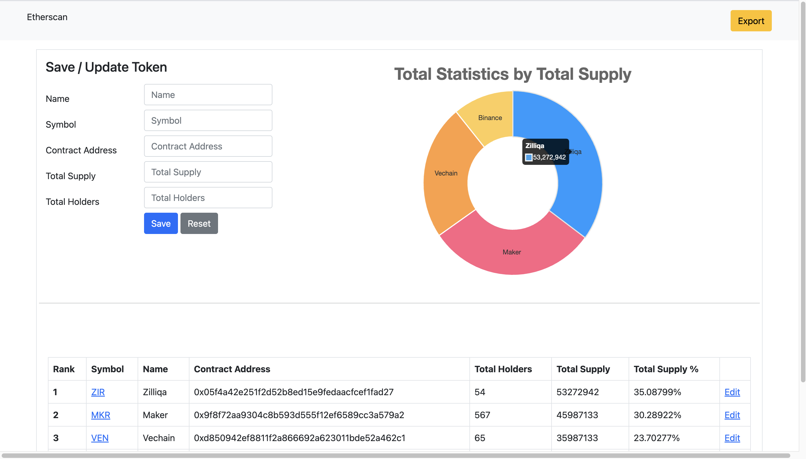

# Assessment

## Requirement (during development)
- Docker Desktop 4.18
- dotnet sdk 7.0.302

## Setup
1. Clone repository
2. Run
```bash
docker compose build && docker compose up -d
```



## Challenges
- Single Page Application (SPA)
	- Save empty html templates and leverage JQuery and Ajax to update page with data accordingly
	- Modify history states to achieve url params in SPA
- Update price every 5 mins
	- Created .NET Core Console Application and initialize a cronjob to execute it every 5 mins

## Reference
1. [Model Validation](https://learn.microsoft.com/en-us/aspnet/core/mvc/models/validation?view=aspnetcore-7.0)
2. [Global exception handling](https://blog.christian-schou.dk/how-to-do-global-exception-handling-in-net-6-and-7/)
3. [Middleware](https://learn.microsoft.com/en-us/aspnet/core/fundamentals/middleware/write?view=aspnetcore-7.0)
4. [CsvHelper](https://joshclose.github.io/CsvHelper/getting-started/#writing-a-csv-file)
5. [ChartJS](https://www.chartjs.org/)
